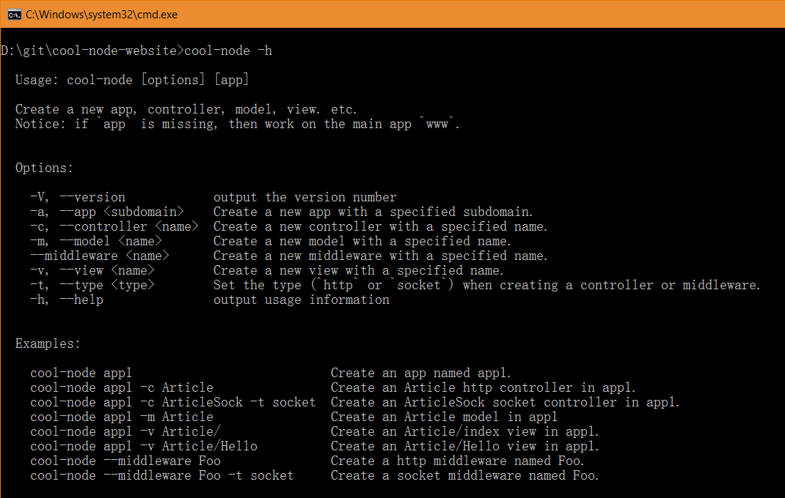

## Command Line App Generator

Version 1.3.0 introduced a command line app generator, it makes producing 
apps, models, controllers, etc. more easier, you just need a simple command to
create new applications from build-in templates.

To enable this feature, you need to configure your computer a little bit, so 
that it can support Cool-Node command line program. All you need to do is 
adding Node.js module directory into the environment variable.

### Windows

In you Explorer's location bar, input this path: 
`Control Panel\System and Security\System`, then click **Advanced system** 
**settings** on the left sidebar, in the popup **System Properties** dialog, 
go to **Advanced** tab, click **Environment Variables...** on the bottom, find
and select **Path** in **User variables**, click **Edit** to modify it, add a 
new item of `.\node_modules\.bin` on the top. If **Path** doesn't exist, you 
can manually create a new one or edit the one in **System variables**.

### Linux

Open a terminal, then use the command `vim ~/.bashrc` to edit user 
configuration file, add a new line on the bottom with contents: 
`export PATH="./node_modules/.bin:$PATH"`, save it and use the command 
`source ~/.bashrc` to reload the configuration.

If you're not familiar with `vim`, you can use a visual editor instead.

### Mac OS

Open a terminal, then use the command `vi ~/.bash_profile` to edit user 
configuration file, add a new line on the bottom with contents: 
`export PATH=./node_modules/.bin:$PATH`, save it and use the command 
`source ~/.bash_profile` to reload the configuration.

If you're not familiar with `vi`, you can use a visual editor instead.

When you have done these, you can now use the command `cool-node` in your 
project to create new apps, produce controllers, etc. Below is a screenshot of
cool-node command help. 

[Next Chapter](MultiProcessing)